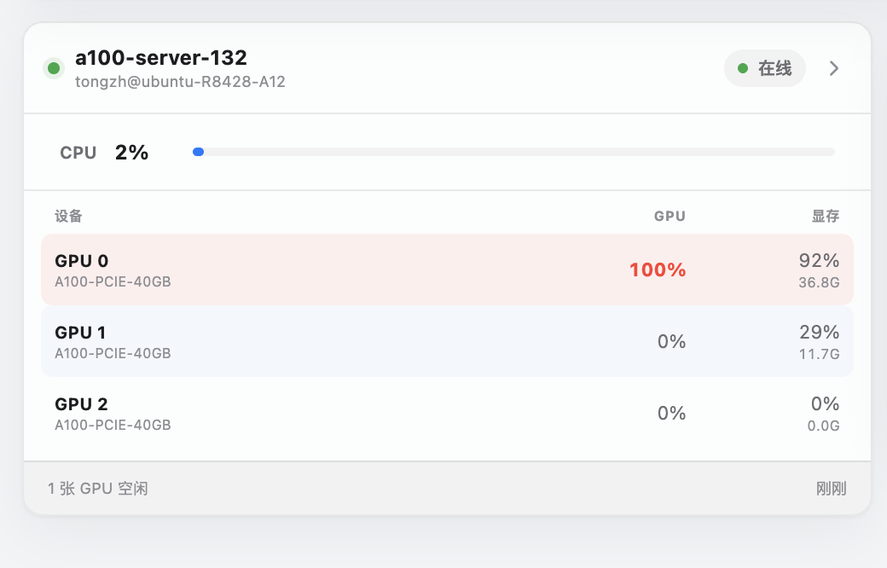
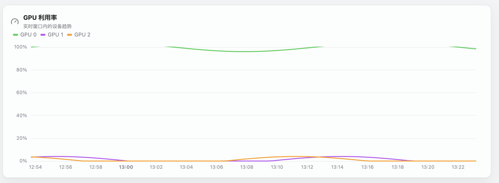
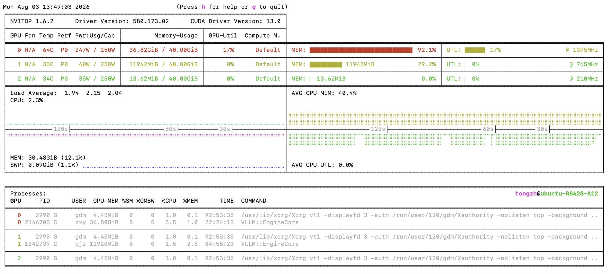
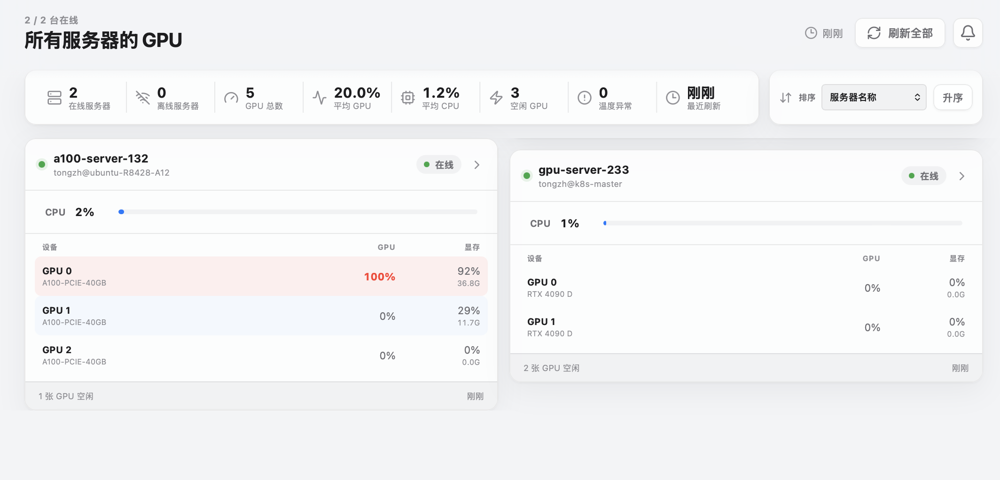

# BUG反馈

## 1. UI 元素显示异常

1. 详情页日志模块、连接模块均有排版问题
2. GPU 总览中的GPU 012之间的颜色之间没有空隙，如图assets/IMG_3.png
3. GPU 的利用率为什么超过 100%，如图assets/IMG_4.png

## 2. 页面结构与交互流程优化

关于这一部分，要我同意修改方案后，才能执行。具体问题如下

1. 总览页面应该就是 GPU 总览，但是总览却是详情页而非总览
2. 详情页中的概览部分，无法看到当前的进程
3. 感觉比起利用率，大家更关心的是 GPU 的 MEM 情况，其次才是 UTL。最后是 MBW 和 PWR 以及温度，进程（这4个可以放到模块的下面，你就是放的是温度，功率，进程数量）
4. 这个概览页面的顺序，应该是核心数据，GPU 情况，CPU 情况（CPU 的 UTL MEM），可视化（4 表格，参考 nvitop）参考assets/IMG_1.png）当前的进程。更多的详情才是概览右边那些按钮该承担的
5. GPU 总览中在 Mac 端的瀑布流显示有问题，网页版没有问题。如图assets/IMG_2.png
6. 刷新全部按钮一直在显示刷新，应该是除非用户点击，才会显示刷新动画。

